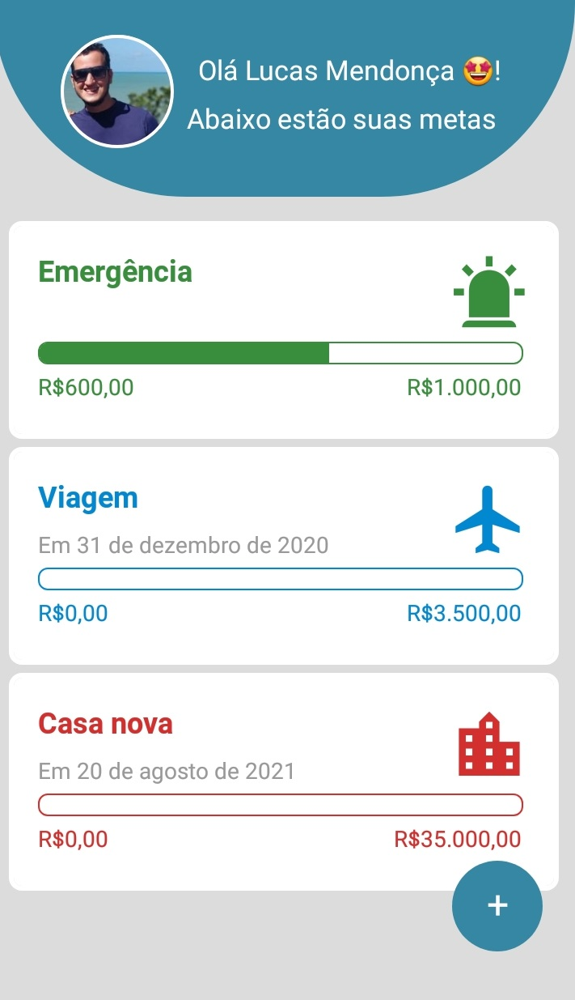

<h1 align="center">
    
</h1>

<h4 align="center">
Bússola Financeira 🧭
</h4>

<p align="center">
  

  
</p>


## 💻 Sobre o projeto

🧭 Bússola Financeira - é uma forma de gerenciamento de metas financeiras.

Nela o usuário pode definir uma meta e de acordo com a data final e o valor desejado, o usuário ficará sabendo quanto deverá armazenar para chegar no determinado valor.

Além disso, pode checar o histórico, dentre outras opções.


## 🎨 Screenshots


<p align="center">
  

  

  

  
</p>


## 📱 Como executar o projeto

```bash
# Clone este repositório
$ git clone https://github.com/lsm-5/bussola_financeira


# Vá para a pasta da aplicação mobile
$ cd mobile

# Instale as dependências
$ yarn

# Execute a aplicação em modo de desenvolvimento
$ yarn start

```

## 😯 Como contribuir para o projeto

1. Faça um **fork** do projeto.
2. Crie uma nova branch com as suas alterações: `git checkout -b my-feature`
3. Salve as alterações e crie uma mensagem de commit contando o que você fez: `git commit -m "feature: My new feature"`
4. Envie as suas alterações: `git push origin my-feature`
> Caso tenha alguma dúvida confira este [guia de como contribuir no GitHub](https://github.com/firstcontributions/first-contributions)


## 📝 Licença

Este projeto esta sobe a licença MIT.

Feito com ❤️ por Lucas Mendonça 👋🏽 [Entre em contato!](https://www.linkedin.com/in/lucas-mendon%C3%A7a-12181a187/)
